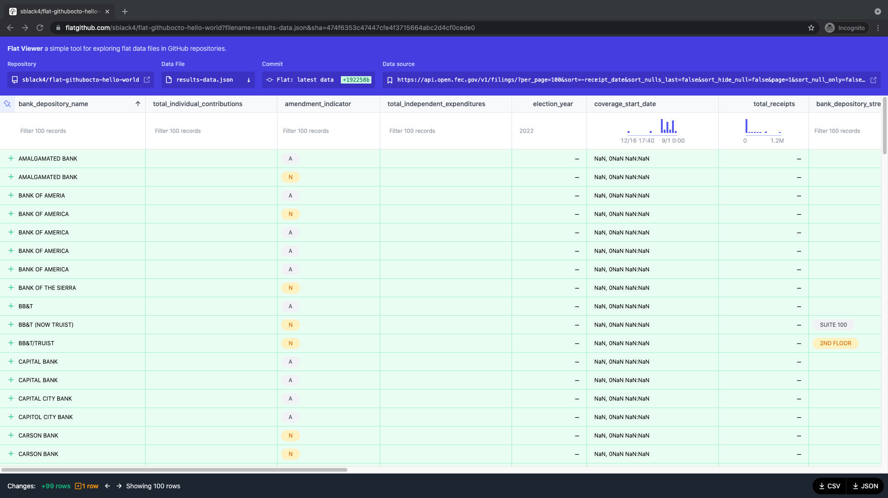

# new fec filings (and hello world to flat)

Uses [Flat](https://github.com/githubocto/flat)

See the [Flat Viewer](https://flatgithub.com/sblack4/flat-githubocto-hello-world?filename=results-data.json)
for a spreadsheet-like experience. 

Queries for new FEC filings from the [open fec /filings/get_filings_ api endpoint](https://api.open.fec.gov/developers/#/filings/get_filings_)

Queries for the last seven days, daily (see workflow).
